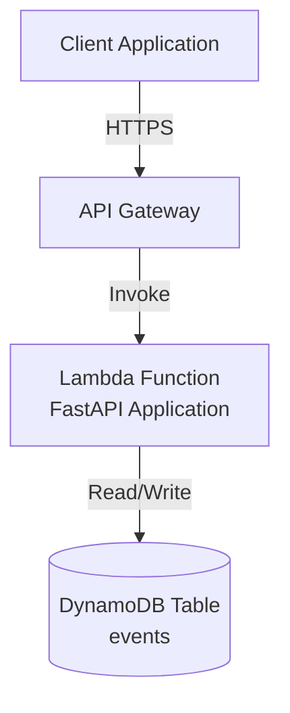

# Event Management API - Design Document

## Overview

The Event Management API is a serverless REST API built with FastAPI that provides CRUD operations for event management. The system uses AWS Lambda for compute, API Gateway for HTTP routing, and DynamoDB for data persistence. The architecture follows serverless best practices to achieve automatic scaling, high availability, and cost efficiency.

The API exposes endpoints for creating, reading, updating, and deleting events, with support for filtering and partial updates. All event data is validated before persistence, and the system provides meaningful error responses for various failure scenarios.

## Architecture

### High-Level Architecture

```
Client → API Gateway → Lambda (FastAPI) → DynamoDB
```

### Component Diagram



### Deployment Architecture

The system uses AWS CDK (Python) to define infrastructure as code:

- **API Gateway**: REST API with Lambda proxy integration
- **Lambda Function**: Runs FastAPI application using Mangum adapter
- **DynamoDB Table**: Single table with eventId as partition key
- **IAM Roles**: Lambda execution role with DynamoDB permissions

### Technology Stack

- **Framework**: FastAPI 0.104.1
- **Runtime**: Python 3.11 on AWS Lambda
- **Adapter**: Mangum (ASGI adapter for Lambda)
- **Database**: AWS DynamoDB
- **AWS SDK**: boto3 for DynamoDB operations
- **Validation**: Pydantic 2.5.0
- **Infrastructure**: AWS CDK (Python)

## Components and Interfaces

### 1. API Layer (FastAPI Application)

**Responsibility**: Handle HTTP requests, route to appropriate handlers, validate input, format responses

**Endpoints**:
- `GET /events` - List all events (with optional status filter)
- `POST /events` - Create a new event
- `GET /events/{eventId}` - Retrieve a specific event
- `PUT /events/{eventId}` - Update an event (partial updates supported)
- `DELETE /events/{eventId}` - Delete an event

**Key Components**:
- `main.py`: FastAPI application setup and Lambda handler
- `routers/events.py`: Event endpoint definitions
- `models/event.py`: Pydantic models for request/response validation
- `services/event_service.py`: Business logic layer
- `repositories/dynamodb_repository.py`: Data access layer

### 2. Service Layer

**Responsibility**: Implement business logic, coordinate between API and data layers

**Key Functions**:
- `create_event(event_data)`: Validate and create event, generate eventId if not provided
- `get_event(event_id)`: Retrieve single event by ID
- `list_events(status_filter)`: Retrieve all events with optional filtering
- `update_event(event_id, update_data)`: Partial update of event fields
- `delete_event(event_id)`: Remove event from storage

### 3. Repository Layer

**Responsibility**: Abstract DynamoDB operations, handle data persistence

**Key Functions**:
- `put_item(event)`: Store event in DynamoDB
- `get_item(event_id)`: Retrieve event by partition key
- `scan_items(filter_expression)`: Scan table with optional filters
- `update_item(event_id, updates)`: Update specific attributes
- `delete_item(event_id)`: Remove item from table

### 4. Infrastructure Layer (AWS CDK)

**Responsibility**: Define and provision AWS resources

**Resources**:
- DynamoDB table with on-demand billing
- Lambda function with appropriate memory and timeout
- API Gateway REST API with Lambda integration
- IAM roles and policies

## Data Models

### Event Model

```python
{
    "eventId": "string",        # Partition key, unique identifier
    "title": "string",          # Required, non-empty
    "description": "string",    # Required
    "date": "string",           # Required, ISO 8601 format (YYYY-MM-DD)
    "location": "string",       # Required, non-empty
    "capacity": integer,        # Required, non-negative
    "organizer": "string",      # Required, non-empty
    "status": "string"          # Required, non-empty (e.g., "active", "cancelled")
}
```

### Request/Response Models

**CreateEventRequest**:
- All fields optional except business-required fields
- eventId is optional (generated if not provided)
- Validation ensures non-empty strings and non-negative capacity

**UpdateEventRequest**:
- All fields optional (partial update)
- Only provided fields are updated
- Same validation rules as create

**EventResponse**:
- Returns complete event object
- Includes all fields from DynamoDB

**EventListResponse**:
- Returns array of event objects
- Empty array if no events match criteria

### DynamoDB Schema

**Table Name**: `events`

**Primary Key**:
- Partition Key: `eventId` (String)

**Attributes**:
- All event fields stored as top-level attributes
- No secondary indexes required for initial implementation
- Consider GSI on status field if filtering performance becomes critical

## Error Handling

### Error Response Format

```python
{
    "detail": "Error message describing what went wrong"
}
```

### HTTP Status Codes

- `200 OK`: Successful GET, PUT, DELETE operations
- `201 Created`: Successful POST operation
- `204 No Content`: Alternative success response for DELETE
- `404 Not Found`: Resource does not exist
- `422 Unprocessable Entity`: Validation failure
- `500 Internal Server Error`: Unexpected server errors

### Error Scenarios

1. **Validation Errors**: Return 422 with details about which fields failed validation
2. **Not Found**: Return 404 when eventId doesn't exist in DynamoDB
3. **DynamoDB Errors**: Catch boto3 exceptions and return 500 with generic message
4. **Missing Required Fields**: Return 422 with list of missing fields

### Exception Handling Strategy

- Use FastAPI exception handlers for consistent error responses
- Log all errors for debugging (CloudWatch Logs)
- Never expose internal implementation details in error messages
- Validate input early to fail fast

## Testing Strategy

### Property-Based Testing

The system will use **Hypothesis** (Python property-based testing library) to verify correctness properties. Each property test will run a minimum of 100 iterations with randomly generated inputs.

**Property Test Configuration**:
```python
from hypothesis import given, settings
@settings(max_examples=100)
```

**Test Tagging Format**:
Each property-based test must include a comment referencing the design document:
```python
# Feature: event-management-api, Property 1: Event creation round trip
```

### Unit Testing

Unit tests will use **pytest** to verify:
- Individual function behavior with specific examples
- Edge cases (empty strings, boundary values)
- Error conditions (invalid inputs, missing data)
- Integration between components

**Test Organization**:
- `tests/unit/test_models.py`: Pydantic model validation
- `tests/unit/test_service.py`: Business logic
- `tests/unit/test_repository.py`: DynamoDB operations (mocked)
- `tests/integration/test_api.py`: End-to-end API tests

### Testing Approach

- **Implementation-first development**: Implement features before writing tests
- **Complementary coverage**: Unit tests catch specific bugs, property tests verify general correctness
- **Minimal test solutions**: Focus on core functionality and important edge cases
- **Real functionality**: No mocks in property tests, use actual DynamoDB Local or mocks only in unit tests where necessary


## Correctness Properties

*A property is a characteristic or behavior that should hold true across all valid executions of a system—essentially, a formal statement about what the system should do. Properties serve as the bridge between human-readable specifications and machine-verifiable correctness guarantees.*

### Property 1: Create-Retrieve Round Trip

*For any* valid event data, creating an event and then retrieving it by eventId should return an event with the same field values.

**Validates: Requirements 1.1, 1.4, 2.1**

### Property 2: Input Validation Completeness

*For any* event data with missing required fields (title, description, date, location, capacity, organizer, status), the API should reject the request with HTTP status 422 and include details about which validations failed.

**Validates: Requirements 1.2, 5.1, 5.2, 5.4, 5.6, 5.7, 6.3**

### Property 3: Type Validation

*For any* event data with invalid data types for any field, the API should reject the request with HTTP status 422 and include a descriptive error message.

**Validates: Requirements 1.3, 3.3, 5.2**

### Property 4: Date Format Validation

*For any* event data with an invalid date format, the API should reject the request with HTTP status 422.

**Validates: Requirements 5.3**

### Property 5: Capacity Validation

*For any* event data with a negative capacity value, the API should reject the request with HTTP status 422.

**Validates: Requirements 5.5**

### Property 6: List Completeness

*For any* set of created events, listing all events should return a collection containing exactly those events.

**Validates: Requirements 2.3**

### Property 7: Status Filter Correctness

*For any* status value and any set of events, filtering by that status should return only events where the status field matches the filter value.

**Validates: Requirements 2.5**

### Property 8: Update Correctness

*For any* existing event and any valid update data, updating the event and then retrieving it should return the event with updated values for the modified fields.

**Validates: Requirements 3.1, 3.4**

### Property 9: Partial Update Preservation

*For any* existing event and any partial update containing a subset of fields, updating the event should modify only the specified fields while preserving all other field values unchanged.

**Validates: Requirements 9.5**

### Property 10: Delete Removes Event

*For any* existing event, deleting it should result in subsequent GET requests for that eventId returning HTTP status 404.

**Validates: Requirements 4.1**

### Property 11: Delete Success Status

*For any* successful delete operation, the API should return HTTP status code 200 or 204.

**Validates: Requirements 4.3**

### Property 12: Not Found Error Handling

*For any* non-existent eventId, GET, PUT, and DELETE operations should return HTTP status 404.

**Validates: Requirements 2.2, 3.2, 4.2**

### Property 13: Client-Provided EventId

*For any* POST request that includes an eventId in the request body, the created event should use that exact eventId rather than generating a new one.

**Validates: Requirements 9.7**

### Property 14: Error Response Format

*For any* error condition, the API response should include a JSON body with a "detail" field containing a descriptive error message.

**Validates: Requirements 6.4**

### Property 15: Create Success Status

*For any* successful create operation, the API should return HTTP status code 201 and include the complete event data with eventId in the response.

**Validates: Requirements 7.1, 9.3**


## API Specification

### Endpoint Details

#### POST /events
**Purpose**: Create a new event

**Request Body**:
```json
{
  "eventId": "string (optional)",
  "title": "string (required)",
  "description": "string (required)",
  "date": "string (required, YYYY-MM-DD format)",
  "location": "string (required)",
  "capacity": "integer (required, >= 0)",
  "organizer": "string (required)",
  "status": "string (required)"
}
```

**Success Response**: 201 Created
```json
{
  "eventId": "generated-or-provided-id",
  "title": "...",
  "description": "...",
  "date": "...",
  "location": "...",
  "capacity": 100,
  "organizer": "...",
  "status": "..."
}
```

**Error Responses**:
- 422: Validation failure

#### GET /events
**Purpose**: List all events with optional filtering

**Query Parameters**:
- `status` (optional): Filter events by status value

**Success Response**: 200 OK
```json
[
  {
    "eventId": "...",
    "title": "...",
    ...
  }
]
```

#### GET /events/{eventId}
**Purpose**: Retrieve a specific event

**Path Parameters**:
- `eventId`: The unique identifier of the event

**Success Response**: 200 OK
```json
{
  "eventId": "...",
  "title": "...",
  ...
}
```

**Error Responses**:
- 404: Event not found

#### PUT /events/{eventId}
**Purpose**: Update an existing event (partial updates supported)

**Path Parameters**:
- `eventId`: The unique identifier of the event

**Request Body** (all fields optional):
```json
{
  "title": "string",
  "description": "string",
  "date": "string",
  "location": "string",
  "capacity": "integer",
  "organizer": "string",
  "status": "string"
}
```

**Success Response**: 200 OK
```json
{
  "eventId": "...",
  "title": "updated value",
  ...
}
```

**Error Responses**:
- 404: Event not found
- 422: Validation failure

#### DELETE /events/{eventId}
**Purpose**: Delete an event

**Path Parameters**:
- `eventId`: The unique identifier of the event

**Success Response**: 200 OK or 204 No Content

**Error Responses**:
- 404: Event not found

## Implementation Considerations

### Lambda Configuration

- **Runtime**: Python 3.11
- **Memory**: 512 MB (adjust based on performance testing)
- **Timeout**: 30 seconds
- **Environment Variables**:
  - `DYNAMODB_TABLE_NAME`: Name of the events table
  - `AWS_REGION`: AWS region for DynamoDB client

### DynamoDB Configuration

- **Billing Mode**: On-demand (pay per request)
- **Partition Key**: eventId (String)
- **Point-in-time Recovery**: Enabled for production
- **Encryption**: AWS managed keys

### API Gateway Configuration

- **Type**: REST API
- **Integration**: Lambda Proxy Integration
- **CORS**: Enable for cross-origin requests
- **Throttling**: Use default AWS limits initially
- **Logging**: Enable CloudWatch Logs for debugging

### FastAPI with Lambda

Use **Mangum** as the ASGI adapter to run FastAPI on Lambda:

```python
from mangum import Mangum
from fastapi import FastAPI

app = FastAPI()

# Define routes...

handler = Mangum(app)
```

### Dependency Injection

Use FastAPI's dependency injection for:
- DynamoDB client initialization
- Repository instance creation
- Service layer dependencies

This enables easier testing and cleaner code organization.

### Environment-Specific Configuration

- **Development**: Use DynamoDB Local or mock for local testing
- **Production**: Use actual DynamoDB table with proper IAM permissions

## Security Considerations

1. **IAM Permissions**: Lambda execution role should have minimal permissions (only DynamoDB operations on the events table)
2. **Input Validation**: All input validated by Pydantic models before processing
3. **Error Messages**: Never expose internal implementation details or stack traces
4. **API Gateway**: Consider adding API keys or AWS IAM authorization for production
5. **Data Encryption**: Use DynamoDB encryption at rest

## Performance Considerations

1. **Cold Starts**: FastAPI with Mangum has reasonable cold start times (~1-2 seconds)
2. **DynamoDB**: On-demand billing handles variable load automatically
3. **Filtering**: Status filtering uses DynamoDB scan with filter expression (consider GSI if performance becomes an issue)
4. **Connection Reuse**: Reuse boto3 DynamoDB client across Lambda invocations

## Deployment Process

1. **Build**: Package FastAPI application with dependencies
2. **Synthesize**: Generate CloudFormation template from CDK code
3. **Deploy**: Deploy stack to AWS using CDK CLI
4. **Verify**: Test endpoints using the API Gateway URL
5. **Monitor**: Check CloudWatch Logs for errors

### CDK Deployment Commands

```bash
cd infrastructure
cdk synth        # Generate CloudFormation template
cdk deploy       # Deploy to AWS
cdk destroy      # Remove all resources
```

## Monitoring and Observability

- **CloudWatch Logs**: All Lambda logs automatically sent to CloudWatch
- **CloudWatch Metrics**: Monitor Lambda invocations, errors, duration
- **DynamoDB Metrics**: Track read/write capacity, throttling
- **API Gateway Metrics**: Monitor request count, latency, errors
- **Alarms**: Set up CloudWatch alarms for error rates and latency thresholds

